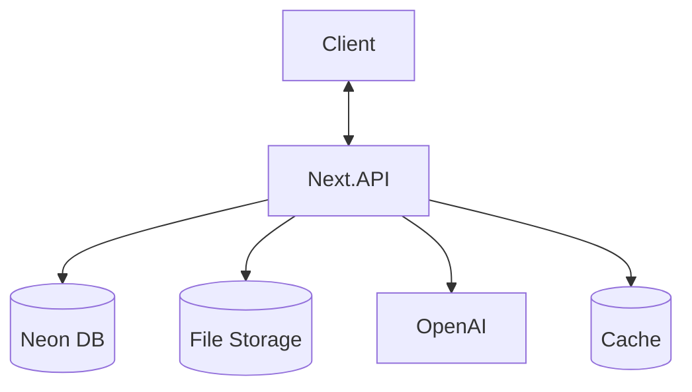
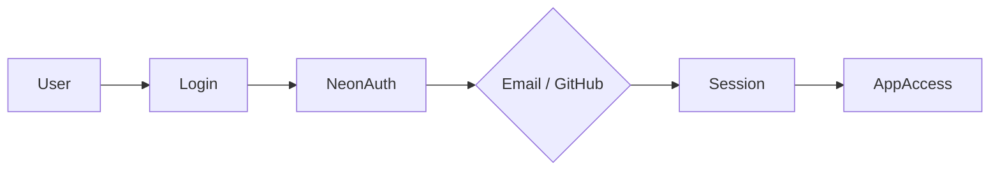
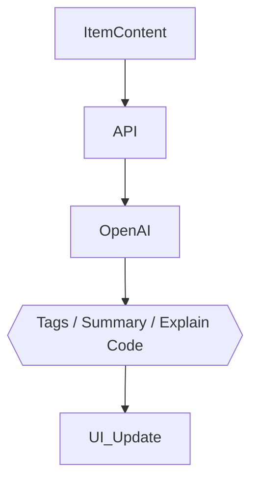

## DevStash Project Specifications

🚀 Centralized Developer Knowledge Hub

---

## DevStash Project Specifications

🚀 **Centralized Developer Knowledge Hub** for code snippets, AI prompts, docs, commands & more.

---

## 📌 Problem (Core Idea)

Developers keep their essentials scattered:

- Code snippets in VS Code or Notion
- AI prompts in chats
- Context files buried in projects
- Useful links in bookmarks
- Docs in random folders
- Commands in .txt files
- Project templates in GitHub gists
- Terminal commands in bash history

This creates **context switching, lost knowledge** and **inconsistent workflows**.

➡️ **DevStash provides ONE searchable, AI‑enhanced hub for all dev knowledge & resources.**

---

## 🧑‍💻 Users

| Persona                    | Needs                                     |
| -------------------------- | ----------------------------------------- |
| Everyday Developer         | Quick access to snippets, commands, links |
| AI‑First Developer         | Store prompts, workflows, contexts        |
| Content Creator / Educator | Save course notes, reusable code          |
| Full‑Stack Builder         | Patterns, boilerplates, API references    |

---

## ✨ Core Features

### A) Items & System Item Types

Items can belong to one of the following built‑in types:

- Snippet
- Prompt
- Note
- Command
- File
- Image
- URL

Custom types allowed for Pro users.

### B) Collections

Organize items—mixed item types allowed.

Examples:

- React Patterns
- Context Files
- Python Snippets

### C) Search

Full‑text search across:

- Content
- Tags
- Titles
- Types

### D) Authentication

- Email + Password
- GitHub OAuth

### E) Additional Features

- Favorites & pinned items
- Recently used
- Import from files
- Markdown editor for text items
- File uploads (images, docs, templates)
- Export (JSON / ZIP)
- Dark mode (default)

### F) AI Superpowers

- Auto‑tagging
- AI summaries
- Explain Code
- Prompt optimization

> AI powered by **OpenAI gpt-5-nano**

---

## 🗄️ Data Model (Rough Drizzle Draft)

> This schema is a starting point and **will evolve**

```ts
import {
  pgTable,
  text,
  boolean,
  varchar,
  integer,
  timestamp,
} from "drizzle-orm/pg-core";

export const users = pgTable("users", {
  id: varchar("id", { length: 36 }).primaryKey(), // provided by Neon Auth
  email: varchar("email", { length: 255 }).notNull().unique(),
  passwordHash: varchar("password_hash", { length: 255 }), // optional for email/password
  isPro: boolean("is_pro").notNull().default(false),
  stripeCustomerId: varchar("stripe_customer_id", { length: 255 }),
  stripeSubscriptionId: varchar("stripe_subscription_id", { length: 255 }),
  createdAt: timestamp("created_at", { withTimezone: true })
    .notNull()
    .defaultNow(),
  updatedAt: timestamp("updated_at", { withTimezone: true })
    .notNull()
    .defaultNow(),
});

export const itemTypes = pgTable("item_types", {
  id: varchar("id", { length: 36 }).primaryKey(),
  name: varchar("name", { length: 100 }).notNull(),
  icon: varchar("icon", { length: 64 }),
  color: varchar("color", { length: 32 }),
  isSystem: boolean("is_system").notNull().default(false),
  userId: varchar("user_id", { length: 36 }).references(() => users.id),
});

export const collections = pgTable("collections", {
  id: varchar("id", { length: 36 }).primaryKey(),
  name: varchar("name", { length: 160 }).notNull(),
  description: text("description"),
  isFavorite: boolean("is_favorite").notNull().default(false),
  userId: varchar("user_id", { length: 36 })
    .notNull()
    .references(() => users.id),
  createdAt: timestamp("created_at", { withTimezone: true })
    .notNull()
    .defaultNow(),
  updatedAt: timestamp("updated_at", { withTimezone: true })
    .notNull()
    .defaultNow(),
});

export const items = pgTable("items", {
  id: varchar("id", { length: 36 }).primaryKey(),
  title: varchar("title", { length: 200 }).notNull(),
  contentType: varchar("content_type", { length: 16 }).notNull(), // text | file
  content: text("content"),
  fileUrl: text("file_url"),
  fileName: varchar("file_name", { length: 255 }),
  fileSize: integer("file_size"),
  url: text("url"),
  description: text("description"),
  isFavorite: boolean("is_favorite").notNull().default(false),
  isPinned: boolean("is_pinned").notNull().default(false),
  language: varchar("language", { length: 64 }),
  userId: varchar("user_id", { length: 36 })
    .notNull()
    .references(() => users.id),
  typeId: varchar("type_id", { length: 36 })
    .notNull()
    .references(() => itemTypes.id),
  collectionId: varchar("collection_id", { length: 36 }).references(
    () => collections.id,
  ),
  createdAt: timestamp("created_at", { withTimezone: true })
    .notNull()
    .defaultNow(),
  updatedAt: timestamp("updated_at", { withTimezone: true })
    .notNull()
    .defaultNow(),
});

export const tags = pgTable("tags", {
  id: varchar("id", { length: 36 }).primaryKey(),
  name: varchar("name", { length: 64 }).notNull(),
  userId: varchar("user_id", { length: 36 })
    .notNull()
    .references(() => users.id),
});

export const itemTags = pgTable("item_tags", {
  itemId: varchar("item_id", { length: 36 })
    .notNull()
    .references(() => items.id),
  tagId: varchar("tag_id", { length: 36 })
    .notNull()
    .references(() => tags.id),
});
```

---

## 🧱 Tech Stack

| Category     | Choice                       |
| ------------ | ---------------------------- |
| Framework    | **Next.js (React 19)**       |
| Language     | TypeScript                   |
| Database     | Neon PostgreSQL + Drizzle ORM |
| Caching      | Redis (optional)             |
| File Storage | Cloudflare R2                |
| CSS/UI       | Tailwind CSS v4 + ShadCN     |
| Auth         | Neon Auth (email + GitHub) |
| AI           | OpenAI gpt-5-nano            |
| Deployment   | Vercel (likely)              |
| Monitoring   | Sentry (later)               |

---

## 💰 Monetization

| Plan | Price           | Limits                  | Features                                        |
| ---- | --------------- | ----------------------- | ----------------------------------------------- |
| Free | $0              | 50 items, 3 collections | Basic search, image uploads, no AI              |
| Pro  | $8/mo or $72/yr | Unlimited               | File uploads, custom types, AI features, export |

> Stripe for subscriptions + webhooks for syncing

---

## 🎨 UI / UX

- Dark mode first
- Minimal, developer‑friendly UI
- Syntax highlighting for code
- Inspired by **Notion, Linear, Raycast**

### Layout

- **Collapsible sidebar** with filters & collections
- Main grid/list workspace
- Full‑screen item editor

### Responsive

- Mobile drawer for sidebar
- Touch‑optimized icons and buttons

---

## 🔌 API Architecture



---

## 🔐 Auth Flow



---

## 🧠 AI Feature Flow



---

## 🗂️ Development Workflow (For Course)

- **One branch per lesson** (students can follow & compare)
- Use **Cursor / Claude Code / ChatGPT** for assistance
- Sentry for runtime monitoring & error tracking
- GitHub Actions (optional for CI)

**Branch examples**:

```
git switch -c lesson-01-setup
```

---

## 🧭 Roadmap

### **MVP**

- Items CRUD
- Collections
- Search
- Basic tags
- Free tier limits

### **Pro Phase**

- AI features
- Custom item types
- File uploads
- Export
- Billing & upgrade flow

### **Future Enhancements**

- Shared collections
- Team/Org plans
- VS Code extension
- Browser extension
- API + CLI tool

---

## 📌 Status

- In planning
- Ready for environment setup & UI scaffolding

---

🏗️ **DevStash — Store Smarter. Build Faster.**
